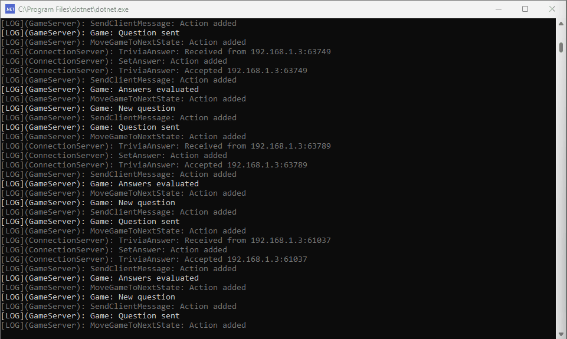
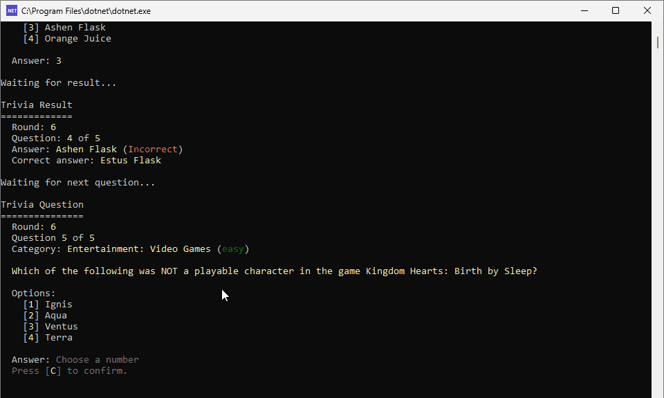
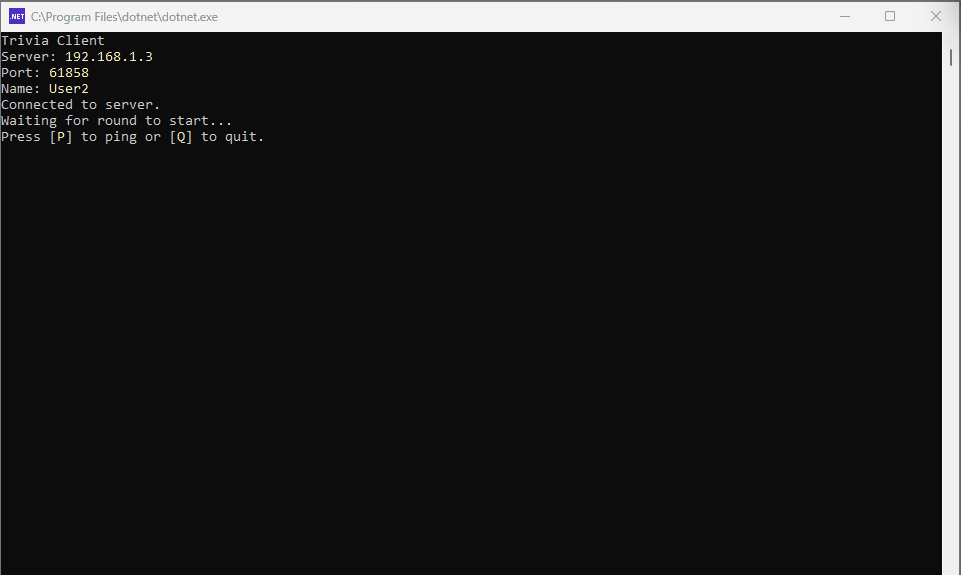
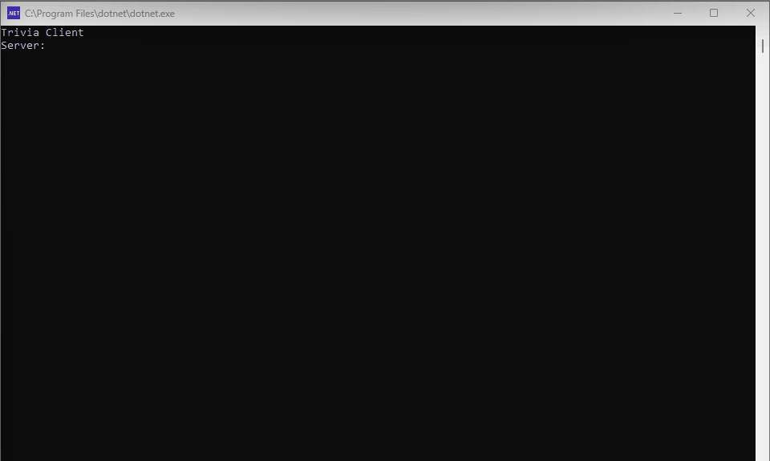

# Trivia
The `Trivia` project is a simple quiz game that allows users to answer questions from different categories. The project uses the [Open Trivia Database API](https://opentdb.com/api_config.php) as the source for the questions.

It consists of both a server component and a client component. The server component is a TCP server that listens for incoming connections from clients. The client component is a simple console application that allows users to connect to the server, see the questions, and answer questions.

## Components

### Trivia.Server
The server component is a console application that listens for incoming TCP connections from clients. It is also responsible for sending questions to clients and receiving answers from them. It is a multi-threaded server that can handle multiple clients simultaneously.

### Trivia.Client
The client component is a simple console application that allows users to connect to the server, see the questions, and answer them. It is a multi-threaded client that allows concurrent sending and receiving of messages to/from the server using TCP sockets.

### Trivia.Common
The `Trivia.Common` project contains common classes and interfaces that are shared between the server and client components. It contains classes for representing the messages sent between components, as well as extension methods for sending or receiving these messages across the TCP client's network stream. It also contains a wrapper class for the Console object as well as extension methods for writing colorful messages to the console.

## Setup

### Server setup
To run the `Trivia.Server`, execute the following command in the `Trivia.Server` directory:
```bash
dotnet run
```

The server will start listening for incoming connections and will display the port it is listening to.

### Client setup
To run the `Trivia.Client`, execute the following command in the `Trivia.Client` directory:
```bash
dotnet run
```

The client will prompt you to enter the IP address and port of the server, as well as a name. Enter the IP address and port displayed on the server application to connect to it, and a name to register.

> NOTE: You can run multiple clients to connect to the server. This simulates multiple users playing the game.

## Trivia game
The trivia game will start as soon as there is at least 1 connected client. However, the server will only start sending out questions after a configurable delay to allow for more clients to join.

If a client connected to the server after the server started sending out questions, it will not participate to the current round and will just wait for the next trivia round to start.

The game consists of multiple rounds with a set number of questions on a set difficulty, taken from a set of categories. The clients will have a configurable time to answer each question. The game will display the correct answer after each question, and the final score and ranking will be displayed at the end of the round, including the overall score and ranking.

After the round, the server will start a new round with the latest settings, provided there are still connected clients.

Any changes to the number of questions, difficulty, or categories will apply only to the next round. The existing round will continue with the settings it started with.

The client can disconnect at any time.

## Sample run
These are all taken at the same time and are just cropped individually for better visibility.

### Trivia.Server

Handling multiple clients and running trivia rounds

### Trivia.Client #1

Currently playing in a trivia round

### Trivia.Client #2

Joined while a trivia round is in progress

### Trivia.Client #3

Joined before the next trivia round starts